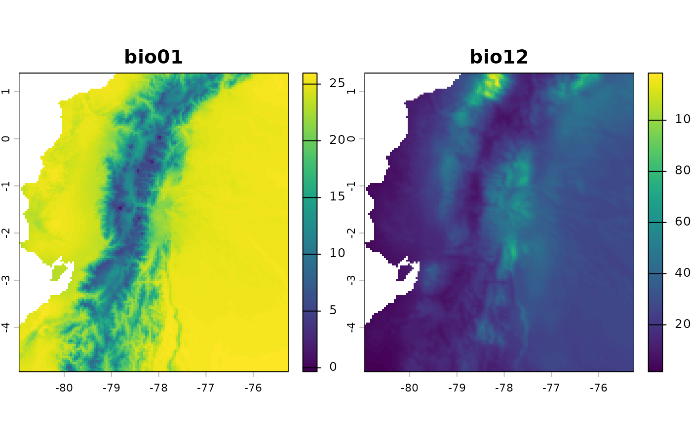
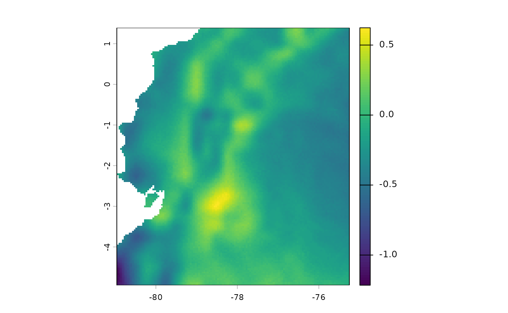
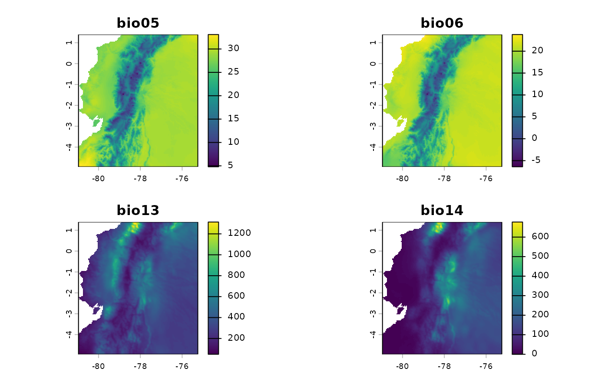
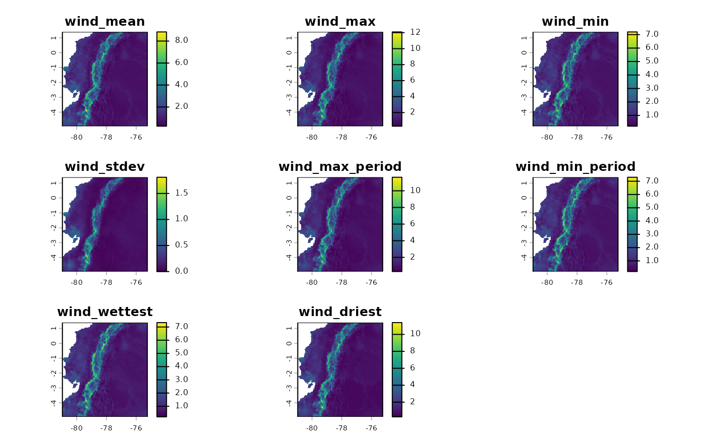
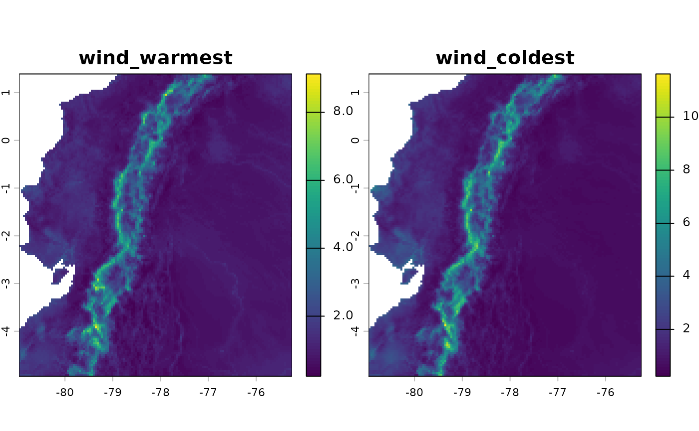
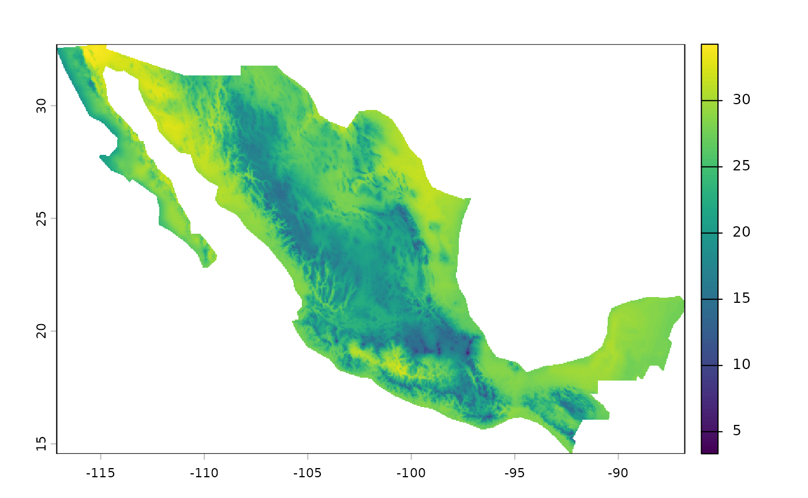
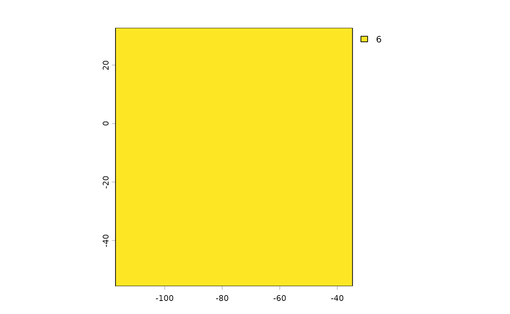
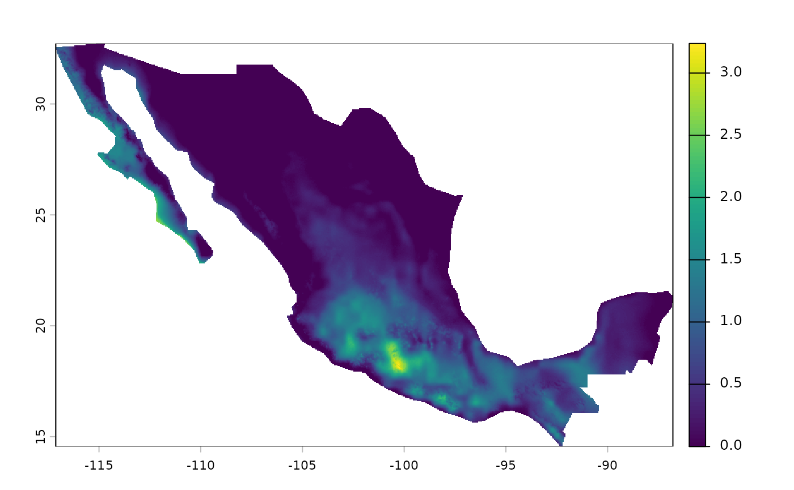

# Tutorial

## `fastbioclim`Package: *Efficient Derivation of Bioclimatic Variables*

The `fastbioclim` package is designed to efficiently generate
bioclimatic variables using two distinct *workflows*.

**In-Memory (“terra”):** The first method is based on the `terra`
package and is ideal when rasters can be processed entirely in the
computer’s RAM.

**Out-of-Core (“tiled”):** The second method is designed for large
rasters. It divides the area of interest into tiles (or grids) that are
processed independently using the `exactextractr` and `Rfast` packages.
This out-of-core approach allows for the analysis of data of any size,
regardless of the available RAM.

The main advantage of `fastbioclim` is that it can intelligently select
the most appropriate method with the argument `method = "auto"`, always
ensuring the best balance between speed and memory usage.

In addition to its performance, `fastbioclim` offers great
flexibility: - It allows for the calculation of a subset of variables
without needing to generate the complete set. - It expands the set to 35
bioclimatic variables, including solar radiation (bios 20-27) and
moisture summaries (bios 28-35) based on the ANUCLIM 6.1 nomenclature
(Xu & Hutchinson, 2012). - It offers the option to define custom time
periods (e.g., weeks, semesters) for period-based variables (like bio08
or bio18). - It allows the use of a real average temperature raster
(parameter `tavg`), instead of the standard approximation of (tmax +
tmin) / 2. - It allows the analysis of any temporal variable (wind
speed, humidity, etc.) with the same powerful and scalable architecture,
using the
[`derive_statistics()`](https://gepinillab.github.io/fastbioclim/reference/derive_statistics.md)
function. - It allows the use of static indices for advanced control,
ideal for time-series analysis (e.g., ensuring the “warmest period”
always refers to the same months each year).

The functionality of fastbioclim is inspired by the `biovars()` function
from the `dismo` package, with the goal of streamlining and scaling the
process of creating bioclimatic variables for ecological and
environmental modeling.

**Disclaimer: This Package is Under Development**

This R package is currently under development and may contain errors,
bugs, or incomplete features.

Contributions and bug reports are welcome. If you encounter issues or
have suggestions for improvement, please open an issue on the
[GitHub](https://github.com/gepinillab/fastbioclim) repository.

### Installation

To install `fastbioclim`, you can use the `remotes` package. If you do
not have it installed, you can do so by running:

``` r
install.packages("remotes")
remotes::install_github("gepinillab/fastbioclim")
```

    ## RcppArmad... (NA -> 15.2.3-1) [CRAN]

    ## ── R CMD build ─────────────────────────────────────────────────────────────────
    ## * checking for file ‘/tmp/RtmpvHHKOC/remotes23aa408e7215/gepinillab-fastbioclim-6bc2d2a/DESCRIPTION’ ... OK
    ## * preparing ‘fastbioclim’:
    ## * checking DESCRIPTION meta-information ... OK
    ## * checking for LF line-endings in source and make files and shell scripts
    ## * checking for empty or unneeded directories
    ## Omitted ‘LazyData’ from DESCRIPTION
    ## * building ‘fastbioclim_0.4.1.tar.gz’

``` r
# Install to get the package example data 
remotes::install_github("gepinillab/egdata.fastbioclim")
```

    ## ── R CMD build ─────────────────────────────────────────────────────────────────
    ## * checking for file ‘/tmp/RtmpvHHKOC/remotes23aa4d2e48f7/gepinillab-egdata.fastbioclim-f40549e/DESCRIPTION’ ... OK
    ## * preparing ‘egdata.fastbioclim’:
    ## * checking DESCRIPTION meta-information ... OK
    ## * checking for LF line-endings in source and make files and shell scripts
    ## * checking for empty or unneeded directories
    ## * building ‘egdata.fastbioclim_0.1.0.tar.gz’

Install and load the necessary packages:

``` r
# Load libraries and install them if necessary
if (!require("terra")) {
  install.packages("terra") 
}
if (!require("future.apply")) {
  install.packages("future.apply") 
}
if (!require("progressr")) {
  install.packages("progressr") 
}
if (!require("fastbioclim")) {
  remotes::install_github("gepinillab/fastbioclim") 
}
if (!require("egdata.fastbioclim")) {
  remotes::install_github("gepinillab/egdata.fastbioclim") 
}
```

### Getting the 19 Bioclimatic Variables for Ecuador

Similar to `biovars()`, this package requires the user to provide the
average climatic variables per time unit for the calculation.
Traditionally, these time units correspond to monthly averages of
temperature and precipitation over decades. For this example, we will
use variables obtained and processed from CHELSA v2.1 (Karger et al.,
2017) for Ecuador, which are available within the data package
(`egdata.fastbioclim` on GitHub only).

``` r
# Get a list of rasters and create a SpatRaster for each variable
# Minimum temperature
tmin_ecu <- system.file("extdata/ecuador/", package = "egdata.fastbioclim") |>
  list.files("tmin", full.names = TRUE) |> rast()
# Maximum temperature
tmax_ecu <- system.file("extdata/ecuador/", package = "egdata.fastbioclim") |>
  list.files("tmax", full.names = TRUE) |> rast()
# Precipitation
prcp_ecu <- system.file("extdata/ecuador/", package = "egdata.fastbioclim") |>
  list.files("prcp", full.names = TRUE) |> rast()

# Define the directory where the rasters will be saved
output_dir_bioclim <- file.path(tempdir(), "bioclim_ecuador")

# Get the 19 variables for Ecuador
bioclim_ecu <- derive_bioclim(
  bios = 1:19,
  tmin = tmin_ecu,
  tmax = tmax_ecu,
  prcp = prcp_ecu,
  output_dir = output_dir_bioclim,
  overwrite = TRUE
)
# Plot bio01 and bio12
plot(bioclim_ecu[[c("bio01", "bio12")]])
```



#### Using Average Temperature as Input

The `fastbioclim` package also offers the option to use average
temperature (defined with the `tavg` parameter) for calculating
bioclimatic variables.

``` r
# Average temperature
tavg_ecu <- system.file("extdata/ecuador/", package = "egdata.fastbioclim") |>
  list.files("tavg", full.names = TRUE) |> rast()
# Define the directory where the rasters will be saved
output_dir_bioclim_v2 <- file.path(tempdir(), "bioclim_ecuador_v2")

bioclim_ecu_v2 <- derive_bioclim(
  bios = 1:19,
  tavg = tavg_ecu,
  tmin = tmin_ecu,
  tmax = tmax_ecu,
  prcp = prcp_ecu,
  output_dir = output_dir_bioclim_v2,
  overwrite = TRUE
)
# Difference between bio01s when tavg is used
plot(bioclim_ecu_v2[["bio01"]] - bioclim_ecu[["bio01"]])
```



#### Selecting a Subset of Variables

Often, it is not necessary to use all bioclimatic variables in our
analyses. For this reason, and unlike `biovars()`, you can define in the
`bios` parameter the number that identifies each of the bioclimatic
variables. This way, it is not necessary to obtain all 19 variables to
then select only the variables of interest. In the following example,
only four variables will be obtained (bio05, bio06, bio13, and bio14).
This example is somewhat faster, as it is not necessary to internally
calculate the warmest/coldest or driest/wettest quarters.

``` r
bios4_ecu <- derive_bioclim(
  tmin = tmin_ecu, 
  tmax = tmax_ecu, 
  prcp = prcp_ecu,
  bios = c(5, 6, 13, 14),
  overwrite = TRUE
)
plot(bios4_ecu)
```



#### Building Summaries with Other Variables

Another important functionality of `fastbioclim` is the option to obtain
statistics similar to bioclimatic variables but with other variables. As
an example, we will create summaries of average monthly wind variables.
For the quarterly interactive variables, we will use the wettest and
driest quarters.

``` r
wind_ecu <- system.file("extdata/ecuador/", package = "egdata.fastbioclim") |>
  list.files("wind", full.names = TRUE) |> rast()
wind_dir_ecu <- file.path(tempdir(), "wind_ecuador")

ecu_stats <- derive_statistics(
  variable = wind_ecu,
  stats = c("mean", "max", "min", "stdev", "max_period", "min_period"),
  inter_variable = prcp_ecu,
  inter_stats = c("max_inter", "min_inter"),
  output_prefix = "wind",
  suffix_inter_max = "wettest",
  suffix_inter_min = "driest",
  overwrite = TRUE,
  output_dir = wind_dir_ecu
)
plot(ecu_stats)
```



Subsets of variables can also be constructed. In this case, we will
create wind variables, but only based on the interaction with
temperature, which correspond to “Wind in the warmest quarter” and “Wind
in the coldest quarter”.

``` r
ecu_stats_v2 <- derive_statistics(
  variable = wind_ecu,
  stats = NULL,
  inter_variable = tavg_ecu,
  inter_stats = c("max_inter", "min_inter"),
  output_prefix = "wind",
  suffix_inter_max = "warmest",
  suffix_inter_min = "coldest",
  overwrite = TRUE,
  output_dir = wind_dir_ecu
)
plot(ecu_stats_v2)
```



### Building for the Neotropics: 35 Variables

Based on the ANUCLIM 6.1 nomenclature (Xu & Hutchinson, 2012),
[`derive_bioclim()`](https://gepinillab.github.io/fastbioclim/reference/derive_bioclim.md)
also offers the option to create bioclimatic variables based on moisture
and solar radiation indices. In this case, we will construct the 35
bioclimatic variables for an extent covering the Neotropics.

For this case, the “auto” method should use the “tiled” method for
creating the variables. But you can also force it to use this method
with the parameter `method="tiled"`. This method will divide the area of
interest into tiles using the decimal degrees defined in the
`tile_degrees` parameter (5 is the default value).

**Parallelization:** It is also important to mention that the ‘tiled’
method can be parallelized using
[`future::plan()`](https://future.futureverse.org/reference/plan.html).
For more information, consult the documentation of that package.

**Progress Bar:** A progress bar is available using the `progressr`
package. To activate it, you need to use the function
[`progressr::handlers()`](https://progressr.futureverse.org/reference/handlers.html)
or
[`progressr::with_progress()`](https://progressr.futureverse.org/reference/with_progress.html).
For more information, consult the documentation of that package.

``` r
# Get a list of rasters and create a SpatRaster for each variable
# Average temperature
tavg_neo <- system.file("extdata/neotropics/", package = "egdata.fastbioclim") |>
  list.files("tavg", full.names = TRUE) |> rast()
# Minimum temperature
tmin_neo <- system.file("extdata/neotropics/", package = "egdata.fastbioclim") |>
  list.files("tmin", full.names = TRUE) |> rast()
# Maximum temperature
tmax_neo <- system.file("extdata/neotropics/", package = "egdata.fastbioclim") |>
  list.files("tmax", full.names = TRUE) |> rast()
# Precipitation
prcp_neo <- system.file("extdata/neotropics/", package = "egdata.fastbioclim") |>
  list.files("prcp", full.names = TRUE) |> rast()
# Solar radiation
srad_neo <- system.file("extdata/neotropics/", package = "egdata.fastbioclim") |>
  list.files("srad", full.names = TRUE) |> rast()
# Climatic moisture index
mois_neo <- system.file("extdata/neotropics/", package = "egdata.fastbioclim") |>
  list.files("cmi", full.names = TRUE) |> rast()

# Define the directory where the rasters will be saved
output_dir_neo <- file.path(tempdir(), "bioclim_neotropics")

# Activate progress bar
# progressr::handlers(global = TRUE)

# Define parallelization plan
# future::plan("multisession", workers = 4)

# Get the 35 variables for the Neotropics
bioclim_neo <- derive_bioclim(
  bios = 1:35,
  tavg = tavg_neo,
  tmin = tmin_neo,
  tmax = tmax_neo,
  prcp = prcp_neo,
  srad = srad_neo,
  mois = mois_neo,
  method = "tiled",
  tile_degrees = 20,
  output_dir = output_dir_neo,
  overwrite = TRUE
)
print(bioclim_neo)
```

    ## class       : SpatRaster 
    ## size        : 2120, 1978, 35  (nrow, ncol, nlyr)
    ## resolution  : 0.04166667, 0.04166667  (x, y)
    ## extent      : -117.1251, -34.70847, -55.60847, 32.72486  (xmin, xmax, ymin, ymax)
    ## coord. ref. : lon/lat WGS 84 (EPSG:4326) 
    ## sources     : bio01.tif  
    ##               bio02.tif  
    ##               bio03.tif  
    ##               ... and 32 more sources
    ## names       :     bio01,       bio02,     bio03,      bio04,     bio05,     bio06, ... 
    ## min values  : -15.08724,  0.06966146,  1.224817,   5.000592, -6.597656, -26.50000, ... 
    ## max values  :  30.27604, 18.90247536, 91.692070, 836.565613, 42.875000,  26.29688, ...

### Example with a User-Defined Region

Another useful parameter in the fastbioclim `package` is the option to
provide an ‘sf’ object to delimit and mask an area of interest. The
calculation of the bioclimatic variables will only be performed in this
area.

``` r
# Get areas of interest
mex <- qs2::qs_read(system.file("extdata/mex.qs2", package = "egdata.fastbioclim"))
# Get only bio10
bio10_mex <- derive_bioclim(
  bios = 10,
  tmax = tmax_neo,
  tmin = tmin_neo,
  user_region = mex,
  overwrite = TRUE,
  output_dir = file.path(tempdir(), "bio10_mex")
)
plot(bio10_mex)
```



### Example with a Static Variable

An advanced option within the package is the ability to determine static
variables for the maximum and minimum variables by months (or units) and
periods. This can be useful if the research questions are related to a
specific time (e.g., seasons of the year) or in the construction of time
series.

In this case, we will create the bio10 variable in Mexico again, but
using the quarter of June, July, and August as a reference. To do this,
we must create a SpatRaster that defines the period of interest. In
`fastbioclim`, the reference is always the first month of the period or
the unit. In this case, that month corresponds to the number 6.
Therefore, we will create a raster filled with this number, to then be
used as a reference in the creation of the ‘bio10’ variable.

``` r
# Create a raster of 6s for the Neotropics
warmest <- tavg_neo[[1]]
warmest[!is.na(warmest)] <- 6
names(warmest) <- "warmest_period"
# Important: For the 'tiled' method, rasters must be saved to disk
terra::writeRaster(warmest, file.path(tempdir(), "warmest_static.tif"), overwrite = TRUE)
warmest <- terra::rast(file.path(tempdir(), "warmest_static.tif"))
plot(warmest)
```



``` r
# Get only bio10
bio10_war <- derive_bioclim(
  bios = 10,
  tmax = tmax_neo,
  tmin = tmin_neo,
  user_region = mex,
  warmest_period = warmest,
  overwrite = TRUE,
  output_dir = file.path(tempdir(), "bio10_war")
)
# Differences in bio10 for Mexico
plot(bio10_mex - bio10_war)
```


