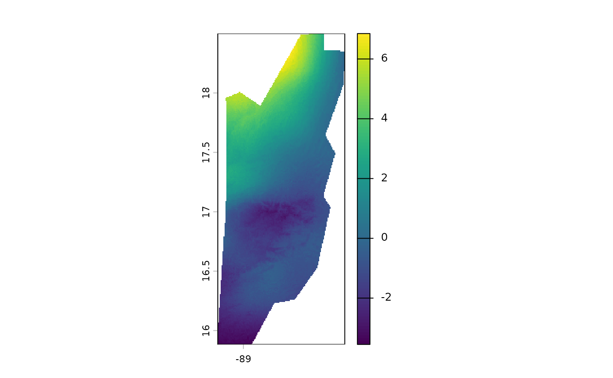

# Calculating Temporal Averages with \`fastbioclim\`

## Introduction

In climatic and environmental data analysis, a fundamental task is to
summarize time series of raster data. This allows us, for example, to
calculate “climatologies” or to understand how conditions have changed
over time.

The `fastbioclim` package offers two powerful and efficient functions
for this task:

1.  [`calculate_average()`](https://gepinillab.github.io/fastbioclim/reference/calculate_average.md):
    Calculates a **static climatological average**. It answers the
    question: *“What is the average maximum temperature for all
    Januaries in my time series?”*.
2.  [`calculate_roll()`](https://gepinillab.github.io/fastbioclim/reference/calculate_roll.md):
    Calculates a **rolling climatological average**. It answers the
    question: *“How has the average for January evolved across different
    time windows?”*.

In this tutorial, we will explore how to use both functions with a
sample dataset of monthly maximum temperature for Belize.

## 0. Installation

To install `fastbioclim`, you can use the `remotes` package. If you do
not have it installed, you can do so by running:

``` r
install.packages("remotes")
remotes::install_github("gepinillab/fastbioclim")
# Install to get the package example data 
remotes::install_github("gepinillab/egdata.fastbioclim")
```

## 1. Setting up the Environment

Before we begin, we need to load the necessary packages. `fastbioclim`
is the main package, `terra` is used for handling raster data, and
`progressr` along with `future` will allow us to see progress bars and
run calculations in parallel for greater efficiency.

``` r
# Load the packages
library(fastbioclim)
library(terra)
```

    ## terra 1.8.86

``` r
library(progressr)

# Configure the processing plan. In this example, we'll use sequential processing. OPTIONAL
# future::plan("sequential")

# Enable global progress bars to monitor progress. OPTIONAL
# progressr::handlers(global = TRUE)
```

## 2. Loading the Sample Data

We will use a time series of maximum temperature (`tmax`) for Belize,
which is included in a sample data package. This series contains 39
years of monthly data (468 layers in total).

``` r
# Get the path to the example files
# system.file() finds files within an installed package
tmax_paths <- system.file("extdata/belize/", package = "egdata.fastbioclim") |>
  list.files(full.names = TRUE)

# Load the files as a single terra SpatRaster object
tmax_bel <- rast(tmax_paths)

# Let's check the structure of our data
# We should have 468 layers, corresponding to 12 months * 39 years
print(tmax_bel)
```

    ## class       : SpatRaster 
    ## size        : 314, 134, 468  (nrow, ncol, nlyr)
    ## resolution  : 0.008333333, 0.008333333  (x, y)
    ## extent      : -89.22514, -88.10847, 15.88319, 18.49986  (xmin, xmax, ymin, ymax)
    ## coord. ref. : lon/lat WGS 84 (EPSG:4326) 
    ## sources     : 1980-01.tif  
    ##               1980-02.tif  
    ##               1980-03.tif  
    ##               ... and 465 more sources
    ## names       : 1980-01, 1980-02, 1980-03, 1980-04, 1980-05, 1980-06, ... 
    ## min values  :     220,     217,     248,     253,     270,     240, ... 
    ## max values  :     276,     278,     317,     316,     334,     299, ...

As we can see, `tmax_bel` is a `SpatRaster` with 468 layers, perfect for
our examples.

## 3. Static Climatological Averages with `calculate_average()`

This is the most common way to calculate a climatology. We want to
obtain 12 rasters: one for the average of all Januaries, one for all
Februaries, and so on.

The key argument here is `index`. It is a numeric vector that tells the
function how to group the layers. For our first example, we will use 30
years of monthly data. To do this, we create an index that repeats the
sequence `1, 2, ..., 12` thirty times.

``` r
# We will use the first 360 layers for our 30-year example
tmax_subset <- tmax_bel[[1:360]]

# Create the index vector: repeat the sequence 1:12 (months) 30 times (years)
monthly_index <- rep(1:12, times = 30)

# Create a temporary directory to save the results
output_path_static <- file.path(tempdir(), "tmax_belize_static_avg")

# Run the function
# progressr will display a progress bar if the operation is lengthy
tmax_avg_static <- calculate_average(
  x = tmax_subset,
  index = monthly_index,
  output_dir = output_path_static,
  overwrite = TRUE, # Allow overwriting if the directory already exists
  output_names = "tmax_avg" # Prefix for the output files
)
```

    ## Using 'auto' method to select workflow...

    ## Data appears to fit in memory. Selecting 'terra' workflow.

    ## Calculating averages using terra::tapp...

    ## Writing final GeoTIFFs...

    ## Processing complete. Final rasters are in: /tmp/RtmpV8swLD/tmax_belize_static_avg

``` r
# The result is a SpatRaster with 12 layers
print(tmax_avg_static)
```

    ## class       : SpatRaster 
    ## size        : 314, 134, 12  (nrow, ncol, nlyr)
    ## resolution  : 0.008333333, 0.008333333  (x, y)
    ## extent      : -89.22514, -88.10847, 15.88319, 18.49986  (xmin, xmax, ymin, ymax)
    ## coord. ref. : lon/lat WGS 84 (EPSG:4326) 
    ## sources     : tmax_avg_01.tif  
    ##               tmax_avg_02.tif  
    ##               tmax_avg_03.tif  
    ##               ... and 9 more sources
    ## names       : tmax_avg_01, tmax_avg_02, tmax_avg_03, tmax_avg_04, tmax_avg_05, tmax_avg_06, ... 
    ## min values  :    210.1667,    223.0000,    241.6333,       254.8,    258.8667,    251.6000, ... 
    ## max values  :    276.4000,    296.5667,    321.5667,       336.9,    339.0667,    320.0333, ...

``` r
# We can visualize the 12 monthly averages
plot(tmax_avg_static)
```


Done! `tmax_avg_static` now holds the 30-year climatology. The first
layer is the average of all Januaries, the second of all Februaries,
etc.

## 4. Rolling Climatological Averages with `calculate_roll()`

What if we want to see if the climate is changing? Instead of a single
average, we can calculate averages for sliding time windows. For
example, the average for years 1-20, then 2-21, 3-22, and so on.

For this, we use
[`calculate_roll()`](https://gepinillab.github.io/fastbioclim/reference/calculate_roll.md).
Its key arguments are:

- `window_size`: The size of the window (in **cycles**, e.g., years).
- `freq`: The number of **units** (layers) per cycle (e.g., 12 for
  months in a year).

### Example 1: 20-Year Window

Let’s calculate the monthly averages for rolling 20-year windows.

``` r
# Create an output directory for this analysis
output_path_rolling <- file.path(tempdir(), "tmax_belize_rolling_avg")

tmax_roll_avg <- calculate_roll(
  x = tmax_bel,
  window_size = 20, # A window of 20 cycles (years)
  freq = 12,        # 12 units (months) per cycle
  output_dir = output_path_rolling,
  output_prefix = "tmax",
  overwrite = TRUE
)
```

    ## Using 'auto' method to select workflow...

    ## A single window appears to fit in memory. Selecting 'terra' workflow.

    ## Processing window: Cycle 1 to 20

    ## Processing window: Cycle 2 to 21

    ## Processing window: Cycle 3 to 22

    ## Processing window: Cycle 4 to 23

    ## Processing window: Cycle 5 to 24

    ## Processing window: Cycle 6 to 25

    ## Processing window: Cycle 7 to 26

    ## Processing window: Cycle 8 to 27

    ## Processing window: Cycle 9 to 28

    ## Processing window: Cycle 10 to 29

    ## Processing window: Cycle 11 to 30

    ## Processing window: Cycle 12 to 31

    ## Processing window: Cycle 13 to 32

    ## Processing window: Cycle 14 to 33

    ## Processing window: Cycle 15 to 34

    ## Processing window: Cycle 16 to 35

    ## Processing window: Cycle 17 to 36

    ## Processing window: Cycle 18 to 37

    ## Processing window: Cycle 19 to 38

    ## Processing window: Cycle 20 to 39

    ## Writing final GeoTIFFs...

    ## Processing complete. Final rasters are in: /tmp/RtmpV8swLD/tmax_belize_rolling_avg

``` r
# How many layers have we created?
# (39 cycles - 20 window size + 1) * 12 units = 20 * 12 = 240 layers
print(tmax_roll_avg)
```

    ## class       : SpatRaster 
    ## size        : 314, 134, 240  (nrow, ncol, nlyr)
    ## resolution  : 0.008333333, 0.008333333  (x, y)
    ## extent      : -89.22514, -88.10847, 15.88319, 18.49986  (xmin, xmax, ymin, ymax)
    ## coord. ref. : lon/lat WGS 84 (EPSG:4326) 
    ## sources     : tmax_w01-20_u01.tif  
    ##               tmax_w01-20_u02.tif  
    ##               tmax_w01-20_u03.tif  
    ##               ... and 237 more sources
    ## names       : tmax_~0_u01, tmax_~0_u02, tmax_~0_u03, tmax_~0_u04, tmax_~0_u05, tmax_~0_u06, ... 
    ## min values  :       211.6,       223.8,      241.95,      255.55,       259.7,      251.75, ... 
    ## max values  :       277.0,       296.0,      319.50,      334.80,       340.1,      319.60, ...

``` r
# Let's check the names of the first 13 layers to understand the output
# We should see the 12 months for the first window (w1-20) and the first of the next
names(tmax_roll_avg)[1:13]
```

    ##  [1] "tmax_w01-20_u01" "tmax_w01-20_u02" "tmax_w01-20_u03" "tmax_w01-20_u04"
    ##  [5] "tmax_w01-20_u05" "tmax_w01-20_u06" "tmax_w01-20_u07" "tmax_w01-20_u08"
    ##  [9] "tmax_w01-20_u09" "tmax_w01-20_u10" "tmax_w01-20_u11" "tmax_w01-20_u12"
    ## [13] "tmax_w02-21_u01"

As you can see, the layer names indicate the window (`w1-20`) and the
unit index (`u`).

### Example 2: Customizing Output Names

The function is highly flexible thanks to the `name_template` argument.
We can define exactly how we want our output files to be named.

``` r
# Define a more descriptive name template
custom_template <- "{prefix}_year_{start_window}-{end_window}_month_{idx_unit}"

# Output directory for the custom names example
output_path_custom <- file.path(tempdir(), "tmax_belize_custom_names")

tmax_roll_custom <- calculate_roll(
  x = tmax_bel,
  window_size = 20,
  freq = 12,
  output_dir = output_path_custom,
  output_prefix = "tmax",
  name_template = custom_template, # Use our custom template
  overwrite = TRUE
)
```

    ## Using 'auto' method to select workflow...

    ## A single window appears to fit in memory. Selecting 'terra' workflow.

    ## Processing window: Cycle 1 to 20

    ## Processing window: Cycle 2 to 21

    ## Processing window: Cycle 3 to 22

    ## Processing window: Cycle 4 to 23

    ## Processing window: Cycle 5 to 24

    ## Processing window: Cycle 6 to 25

    ## Processing window: Cycle 7 to 26

    ## Processing window: Cycle 8 to 27

    ## Processing window: Cycle 9 to 28

    ## Processing window: Cycle 10 to 29

    ## Processing window: Cycle 11 to 30

    ## Processing window: Cycle 12 to 31

    ## Processing window: Cycle 13 to 32

    ## Processing window: Cycle 14 to 33

    ## Processing window: Cycle 15 to 34

    ## Processing window: Cycle 16 to 35

    ## Processing window: Cycle 17 to 36

    ## Processing window: Cycle 18 to 37

    ## Processing window: Cycle 19 to 38

    ## Processing window: Cycle 20 to 39

    ## Writing final GeoTIFFs...

    ## Processing complete. Final rasters are in: /tmp/RtmpV8swLD/tmax_belize_custom_names

``` r
# Let's verify the new names
names(tmax_roll_custom)[1:13]
```

    ##  [1] "tmax_year_01-20_month_01" "tmax_year_01-20_month_02"
    ##  [3] "tmax_year_01-20_month_03" "tmax_year_01-20_month_04"
    ##  [5] "tmax_year_01-20_month_05" "tmax_year_01-20_month_06"
    ##  [7] "tmax_year_01-20_month_07" "tmax_year_01-20_month_08"
    ##  [9] "tmax_year_01-20_month_09" "tmax_year_01-20_month_10"
    ## [11] "tmax_year_01-20_month_11" "tmax_year_01-20_month_12"
    ## [13] "tmax_year_02-21_month_01"

### Analyzing the Rolling Average Results

Visualizing 240 layers at once is not practical. A more interesting
analysis is to see how the average of a specific month has changed
across the different windows.

Let’s extract and visualize all the averages for **January** (`_u01`).

``` r
# Select all layers corresponding to January (unit index 01)
# We use grep() to find the pattern "_u01" in the layer names
january_indices <- grep("_u01", names(tmax_roll_avg), value = TRUE)

# Create a SpatRaster subset with only the January layers
rolling_januaries <- tmax_roll_avg[[january_indices]]

# Let's rename the layers for clarity (indicating the window)
names(rolling_januaries) <- paste0("January_window_", 1:20)

# Now we can visualize the change between the first and last rolling average for January
plot(rolling_januaries[[20]] - rolling_januaries[[1]])
```



This map shows how the average maximum temperature in January has
changed over the last years, allowing us to identify warming or cooling
trends. It’s important to note that the temperature layers used are
scaled by 10. Therefore, some areas show changes of up to 0.8 degrees
Celsius.

## Conclusion

The `fastbioclim` package greatly simplifies the calculation of temporal
summaries for raster time series. \* Use
[`calculate_average()`](https://gepinillab.github.io/fastbioclim/reference/calculate_average.md)
for static climatologies over the entire study period. \* Use
[`calculate_roll()`](https://gepinillab.github.io/fastbioclim/reference/calculate_roll.md)
to analyze trends and changes across moving time windows.

Both functions are optimized for efficiency and can leverage parallel
processing to handle large datasets.
