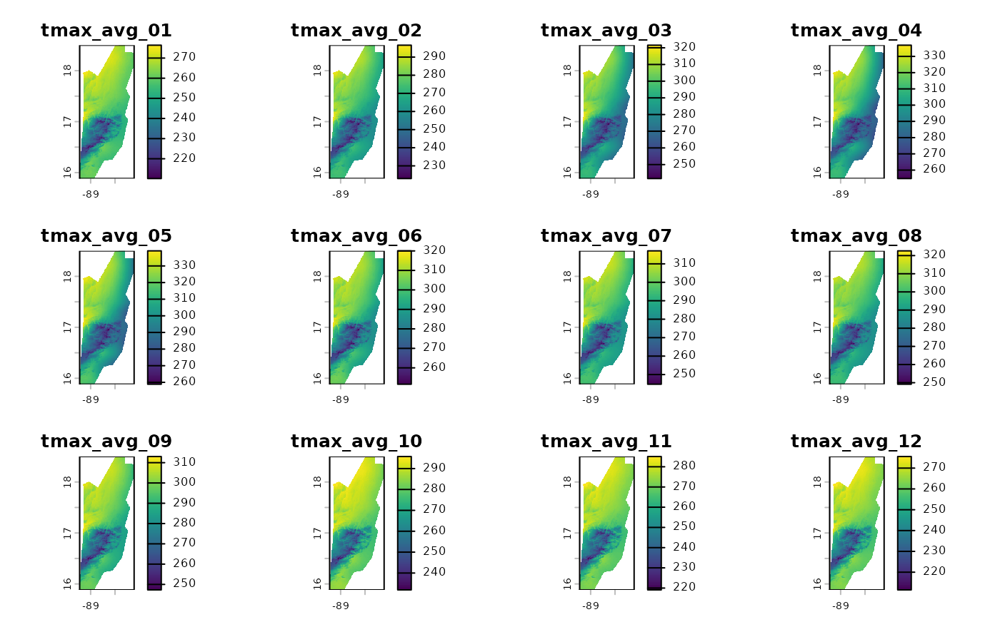

# Cálculo de Promedios Temporales con \`fastbioclim\`

## Introducción

En el análisis de datos climáticos y ambientales, una tarea fundamental
es resumir series de tiempo de datos ráster. Esto nos permite, por
ejemplo, calcular “climatologías” o entender cómo han cambiado las
condiciones a lo largo del tiempo.

El paquete `fastbioclim` ofrece dos funciones potentes y eficientes para
esta tarea:

1.  [`calculate_average()`](https://gepinillab.github.io/fastbioclim/reference/calculate_average.md):
    Calcula un **promedio climatológico estático**. Responde a la
    pregunta: *“¿Cuál es la temperatura máxima promedio para todos los
    eneros en mi serie de tiempo?”*.
2.  [`calculate_roll()`](https://gepinillab.github.io/fastbioclim/reference/calculate_roll.md):
    Calcula un **promedio climatológico móvil (rodante)**. Responde a la
    pregunta: *“¿Cómo ha cambaido el promedio de enero a lo largo de
    diferentes ventanas de tiempo?”*.

En este tutorial, exploraremos cómo usar ambas funciones utilizando un
conjunto de datos de ejemplo de temperatura máxima mensual para Belice.

## 0. Instalación

Para instalar `fastbioclim`, puede utilizar el paquete `remotes`. Si aún
no lo tiene instalado, puede hacerlo ejecutando:

``` r
install.packages("remotes")
remotes::install_github("gepinillab/fastbioclim")
# Instalar para obtener los datos de ejemplo 
remotes::install_github("gepinillab/egdata.fastbioclim")
```

## 1. Configuración del Entorno

Antes de empezar, necesitamos cargar los paquetes necesarios.
`fastbioclim` es el paquete principal, `terra` se usa para manejar los
datos ráster, y `progressr` junto con `future` nos permitirán ver barras
de progreso y ejecutar los cálculos en paralelo para mayor eficiencia.

``` r
# Cargar los paquetes
library(fastbioclim)
library(terra)
```

    ## terra 1.8.80

``` r
library(progressr)

# Configurar el procesamiento en paralelo para acelerar los cálculos
# Usaremos solo un núcleo en este ejemplo. OPCIONAL
# future::plan("sequential")

# Habilitar las barras de progreso globales para ver el avance. OPCIONAL
# progressr::handlers(global = TRUE)
```

## 2. Cargar los Datos de Ejemplo

Utilizaremos una serie de tiempo de temperatura máxima (`tmax`) para
Belice, que viene incluida en un paquete de datos de ejemplo. Esta serie
contiene 39 años de datos mensuales (468 capas en total).

``` r
# Obtener la ruta a los archivos de ejemplo
# system.file() busca archivos dentro de un paquete instalado
tmax_paths <- system.file("extdata/belize/", package = "egdata.fastbioclim") |>
  list.files(full.names = TRUE)

# Cargar los archivos como un único objeto SpatRaster de terra
tmax_bel <- rast(tmax_paths)

# Verifiquemos la estructura de nuestros datos
# Deberíamos tener 468 capas, que corresponden a 12 meses * 39 años
print(tmax_bel)
```

    ## class       : SpatRaster 
    ## size        : 314, 134, 468  (nrow, ncol, nlyr)
    ## resolution  : 0.008333333, 0.008333333  (x, y)
    ## extent      : -89.22514, -88.10847, 15.88319, 18.49986  (xmin, xmax, ymin, ymax)
    ## coord. ref. : lon/lat WGS 84 (EPSG:4326) 
    ## sources     : 1980-01.tif  
    ##               1980-02.tif  
    ##               1980-03.tif  
    ##               ... and 465 more sources
    ## names       : 1980-01, 1980-02, 1980-03, 1980-04, 1980-05, 1980-06, ... 
    ## min values  :     220,     217,     248,     253,     270,     240, ... 
    ## max values  :     276,     278,     317,     316,     334,     299, ...

Como podemos ver, `tmax_bel` es un `SpatRaster` con 468 capas, perfecto
para nuestros ejemplos.

## 3. Promedios Climatológicos Estáticos con `calculate_average()`

Esta es la forma más común de calcular una climatología. Queremos
obtener 12 rásters: uno para el promedio de todos los eneros, uno para
todos los febreros, y así sucesivamente.

El argumento clave aquí es `index`. Es un vector numérico que le dice a
la función cómo agrupar las capas. Para el primer ejemplo, vamos a usar
30 años de datos mensuales. Para ello creamos un índice que repite la
secuencia `1, 2, ..., 12` treinta veces.

``` r
# Usaremos las primeras 360 capas para nuestro ejemplo de 30 años
tmax_subset <- tmax_bel[[1:360]]

# Crear el vector de índice: repite la secuencia 1:12 (meses) 30 veces (años)
index_mensual <- rep(1:12, times = 30)

# Crear un directorio temporal para guardar los resultados
output_path_static <- file.path(tempdir(), "tmax_belize_static_avg")

# Ejecutar la función
# progressr mostrará una barra de progreso si la operación es larga
tmax_avg_static <- calculate_average(
  x = tmax_subset,
  index = index_mensual,
  output_dir = output_path_static,
  overwrite = TRUE, # Permitir sobreescribir si el directorio ya existe
  output_names = "tmax_avg" # Prefijo para los archivos de salida
)
```

    ## Using 'auto' method to select workflow...

    ## Data appears to fit in memory. Selecting 'terra' workflow.

    ## Calculating averages using terra::tapp...

    ## Writing final GeoTIFFs...

    ## Processing complete. Final rasters are in: /tmp/Rtmp7fwNHh/tmax_belize_static_avg

``` r
# El resultado es un SpatRaster con 12 capas
print(tmax_avg_static)
```

    ## class       : SpatRaster 
    ## size        : 314, 134, 12  (nrow, ncol, nlyr)
    ## resolution  : 0.008333333, 0.008333333  (x, y)
    ## extent      : -89.22514, -88.10847, 15.88319, 18.49986  (xmin, xmax, ymin, ymax)
    ## coord. ref. : lon/lat WGS 84 (EPSG:4326) 
    ## sources     : tmax_avg_01.tif  
    ##               tmax_avg_02.tif  
    ##               tmax_avg_03.tif  
    ##               ... and 9 more sources
    ## names       : tmax_avg_01, tmax_avg_02, tmax_avg_03, tmax_avg_04, tmax_avg_05, tmax_avg_06, ... 
    ## min values  :    210.1667,    223.0000,    241.6333,       254.8,    258.8667,    251.6000, ... 
    ## max values  :    276.4000,    296.5667,    321.5667,       336.9,    339.0667,    320.0333, ...

``` r
# Podemos visualizar los 12 promedios mensuales
plot(tmax_avg_static)
```



¡Listo! `tmax_avg_static` contiene la climatología de 30 años. La
primera capa es el promedio de todos los eneros, la segunda de todos los
febreros, etc.

## 4. Promedios Climatológicos Móviles con `calculate_roll()`

¿Y si queremos ver si el clima está cambiando? En lugar de un único
promedio, podemos calcular promedios para ventanas de tiempo que se
deslizan. Por ejemplo, el promedio de los años 1-20, luego 2-21, 3-22, y
así sucesivamente.

Para esto, usamos
[`calculate_roll()`](https://gepinillab.github.io/fastbioclim/reference/calculate_roll.md).
Sus argumentos clave son:

- `window_size`: El tamaño de la ventana (en **ciclos**, por ejemplo,
  años).
- `freq`: El número de **unidades** (capas) por ciclo (e.g., 12 para
  meses en un año).

### Ejemplo 1: Ventana de 20 años

Calculemos los promedios mensuales para ventanas móviles de 20 años.

``` r
# Crear un directorio de salida para este análisis
output_path_rolling <- file.path(tempdir(), "tmax_belize_rolling_avg")

tmax_roll_avg <- calculate_roll(
  x = tmax_bel,
  window_size = 20, # Una ventana de 20 ciclos (años)
  freq = 12,        # 12 unidades (meses) por ciclo
  output_dir = output_path_rolling,
  output_prefix = "tmax",
  overwrite = TRUE
)
```

    ## Using 'auto' method to select workflow...

    ## A single window appears to fit in memory. Selecting 'terra' workflow.

    ## Processing window: Cycle 1 to 20

    ## Processing window: Cycle 2 to 21

    ## Processing window: Cycle 3 to 22

    ## Processing window: Cycle 4 to 23

    ## Processing window: Cycle 5 to 24

    ## Processing window: Cycle 6 to 25

    ## Processing window: Cycle 7 to 26

    ## Processing window: Cycle 8 to 27

    ## Processing window: Cycle 9 to 28

    ## Processing window: Cycle 10 to 29

    ## Processing window: Cycle 11 to 30

    ## Processing window: Cycle 12 to 31

    ## Processing window: Cycle 13 to 32

    ## Processing window: Cycle 14 to 33

    ## Processing window: Cycle 15 to 34

    ## Processing window: Cycle 16 to 35

    ## Processing window: Cycle 17 to 36

    ## Processing window: Cycle 18 to 37

    ## Processing window: Cycle 19 to 38

    ## Processing window: Cycle 20 to 39

    ## Writing final GeoTIFFs...

    ## Processing complete. Final rasters are in: /tmp/Rtmp7fwNHh/tmax_belize_rolling_avg

``` r
# ¿Cuántas capas hemos creado?
# (39 ciclos - 20 de ventana + 1) * 12 unidades = 20 * 12 = 240 capas
print(tmax_roll_avg)
```

    ## class       : SpatRaster 
    ## size        : 314, 134, 240  (nrow, ncol, nlyr)
    ## resolution  : 0.008333333, 0.008333333  (x, y)
    ## extent      : -89.22514, -88.10847, 15.88319, 18.49986  (xmin, xmax, ymin, ymax)
    ## coord. ref. : lon/lat WGS 84 (EPSG:4326) 
    ## sources     : tmax_w01-20_u01.tif  
    ##               tmax_w01-20_u02.tif  
    ##               tmax_w01-20_u03.tif  
    ##               ... and 237 more sources
    ## names       : tmax_~0_u01, tmax_~0_u02, tmax_~0_u03, tmax_~0_u04, tmax_~0_u05, tmax_~0_u06, ... 
    ## min values  :       211.6,       223.8,      241.95,      255.55,       259.7,      251.75, ... 
    ## max values  :       277.0,       296.0,      319.50,      334.80,       340.1,      319.60, ...

``` r
# Veamos los nombres de las primeras 13 capas para entender la salida
# Deberíamos ver los 12 meses para la primera ventana (w1-20) y el primero de la siguiente
names(tmax_roll_avg)[1:13]
```

    ##  [1] "tmax_w01-20_u01" "tmax_w01-20_u02" "tmax_w01-20_u03" "tmax_w01-20_u04"
    ##  [5] "tmax_w01-20_u05" "tmax_w01-20_u06" "tmax_w01-20_u07" "tmax_w01-20_u08"
    ##  [9] "tmax_w01-20_u09" "tmax_w01-20_u10" "tmax_w01-20_u11" "tmax_w01-20_u12"
    ## [13] "tmax_w02-21_u01"

Como se puede ver, los nombres de las capas nos indican la ventana
(`w1-20`) y el índice de la unidad (`u`).

### Ejemplo 2: Personalizando los Nombres de Salida

La función es muy flexible gracias al argumento `name_template`. Podemos
definir exactamente cómo queremos que se llamen nuestros archivos de
salida.

``` r
# Definir una plantilla de nombres más descriptiva
template_personalizado <- "{prefix}_año_{start_window}-{end_window}_mes_{idx_unit}"

# Directorio de salida para el ejemplo con nombres personalizados
output_path_custom <- file.path(tempdir(), "tmax_belize_custom_names")

tmax_roll_custom <- calculate_roll(
  x = tmax_bel,
  window_size = 20,
  freq = 12,
  output_dir = output_path_custom,
  output_prefix = "tmax",
  name_template = template_personalizado, # Usamos nuestra plantilla
  overwrite = TRUE
)
```

    ## Using 'auto' method to select workflow...

    ## A single window appears to fit in memory. Selecting 'terra' workflow.

    ## Processing window: Cycle 1 to 20

    ## Processing window: Cycle 2 to 21

    ## Processing window: Cycle 3 to 22

    ## Processing window: Cycle 4 to 23

    ## Processing window: Cycle 5 to 24

    ## Processing window: Cycle 6 to 25

    ## Processing window: Cycle 7 to 26

    ## Processing window: Cycle 8 to 27

    ## Processing window: Cycle 9 to 28

    ## Processing window: Cycle 10 to 29

    ## Processing window: Cycle 11 to 30

    ## Processing window: Cycle 12 to 31

    ## Processing window: Cycle 13 to 32

    ## Processing window: Cycle 14 to 33

    ## Processing window: Cycle 15 to 34

    ## Processing window: Cycle 16 to 35

    ## Processing window: Cycle 17 to 36

    ## Processing window: Cycle 18 to 37

    ## Processing window: Cycle 19 to 38

    ## Processing window: Cycle 20 to 39

    ## Writing final GeoTIFFs...

    ## Processing complete. Final rasters are in: /tmp/Rtmp7fwNHh/tmax_belize_custom_names

``` r
# Verifiquemos los nuevos nombres
names(tmax_roll_custom)[1:13]
```

    ##  [1] "tmax_año_01-20_mes_01" "tmax_año_01-20_mes_02" "tmax_año_01-20_mes_03"
    ##  [4] "tmax_año_01-20_mes_04" "tmax_año_01-20_mes_05" "tmax_año_01-20_mes_06"
    ##  [7] "tmax_año_01-20_mes_07" "tmax_año_01-20_mes_08" "tmax_año_01-20_mes_09"
    ## [10] "tmax_año_01-20_mes_10" "tmax_año_01-20_mes_11" "tmax_año_01-20_mes_12"
    ## [13] "tmax_año_02-21_mes_01"

### Analizando los Resultados del Promedio Móvil

Visualizar 240 capas a la vez no es práctico. Un análisis más
interesante es, por ejemplo, ver cómo ha cambiado el promedio de un mes
específico a lo largo de las ventanas.

Vamos a extraer y visualizar todos los promedios de **enero** (`idx01`).

``` r
# Seleccionar todas las capas que corresponden a enero (índice 01)
# Usamos grep() para buscar el patrón "_u01" en los nombres de las capas
indices_enero <- grep("_u01", names(tmax_roll_avg), value = TRUE)

# Crear un subconjunto del SpatRaster solo con los eneros
eneros_moviles <- tmax_roll_avg[[indices_enero]]

# Cambiemos los nombres para que sean más claros (indican la ventana)
names(eneros_moviles) <- paste0("Enero", 1:20)

# Ahora podemos visualizar el cambio entre el primer y último enero
plot(eneros_moviles[[20]] - eneros_moviles[[1]])
```


Este gráfico nos muestra cómo ha cambiado la temperatura máxima promedio
de enero en lso últimos años, permitiéndonos identificar tendencias de
calentamiento o enfriamiento. Es importante mencionar que las capas
usadas de temperatura máxima están multiplicadas por 10. Por lo cual,
existe partes con cambios de hast 0.8 grados centigrados.

## Conclusión

El paquete `fastbioclim` simplifica enormemente el cálculo de resúmenes
temporales en series de tiempo de rásters. \* Usa
[`calculate_average()`](https://gepinillab.github.io/fastbioclim/reference/calculate_average.md)
para climatologías estáticas sobre todo el período de estudio. \* Usa
[`calculate_roll()`](https://gepinillab.github.io/fastbioclim/reference/calculate_roll.md)
para analizar tendencias y cambios a través de ventanas de tiempo
móviles.

Ambas funciones están optimizadas para ser eficientes y pueden
aprovechar el procesamiento en paralelo para manejar grandes volúmenes
de datos.
